# EventHub: Campus Event Discovery and Management Platform

> A release-ready Android platform for campus event discovery, RSVP and ticketing, organizer workflows, admin moderation, SOS escalation, reminders, and vendor coordination.

**Platform:** Android (Java + XML)  
**Primary Backend:** Firebase  
**Payments:** Stripe via Supabase Edge Function  
**Current State:** Final prototype ready for submission, demo, and release evaluation

## Table of Contents

1. [Release Snapshot](#release-snapshot)
2. [Submission Deliverables Mapping](#submission-deliverables-mapping)
3. [Product Overview](#product-overview)
4. [Design, Mockups, and Storyboards](#design-mockups-and-storyboards)
5. [User Stories and Backlog Status](#user-stories-and-backlog-status)
6. [System Architecture and Object-Oriented Design](#system-architecture-and-object-oriented-design)
7. [UML Diagrams and Flowcharts](#uml-diagrams-and-flowcharts)
8. [Feature Implementation](#feature-implementation)
9. [Firebase, Backend, and Infrastructure](#firebase-backend-and-infrastructure)
10. [Testing and Quality Assurance](#testing-and-quality-assurance)
11. [Sprint Planning, Reviews, and GitHub Workflow](#sprint-planning-reviews-and-github-workflow)
12. [Repository Structure](#repository-structure)
13. [Setup and Run](#setup-and-run)
14. [Supporting Documentation](#supporting-documentation)
15. [Team](#team)

## Release Snapshot

EventHub is a three-sided campus platform built for LUMS that serves:

- **Attendees** who browse, search, save, RSVP, pay, receive reminders, access tickets, submit feedback, and manage memories.
- **Organizers** who create proposals, manage approved events, scan attendees, blacklist abusive users, coordinate vendors, and monitor SOS incidents tied to their events.
- **Admins** who review proposals, approve or reject content, review vendor requests, monitor platform activity, and control maintenance-related configuration.

The repository now includes:

- A final submission README at the project root.
- The previous phase README preserved as [docs/phase3_README.md](docs/phase3_README.md).
- Supplemental implementation notes moved into [docs/](docs/).
- UML diagrams, storyboard images, GitHub board screenshots, database notes, and testing plans under [docs/images](docs/images) and [docs/](docs/).

## Submission Deliverables Mapping

This README is written to map directly to the final submission requirements.

| Deliverable | Where It Is Covered |
|---|---|
| Addressing feedback | [docs/README_BUG.md](docs/README_BUG.md), [docs/README_DIFF.md](docs/README_DIFF.md), [docs/Important_improvements.md](docs/Important_improvements.md), [docs/PROJECT_CHANGELOG.md](docs/PROJECT_CHANGELOG.md) |
| Code base of prototype | `app/`, `functions/`, `supabase/`, Gradle build files, Firebase config files |
| Code documentation | Source file headers and inline comments in codebase; Javadoc work is being maintained separately and is intentionally not duplicated here |
| Test cases | `app/src/test/java/`, `app/src/androidTest/java/`, [docs/testing_coverage_report.md](docs/testing_coverage_report.md), [docs/sos_test_plan.md](docs/sos_test_plan.md) |
| Object-oriented design | UML diagrams in this README and under [docs/images/uml](docs/images/uml) |
| Product backlog | User story summary in this README, sprint breakdown in [docs/github_4_stage_breakdown.md](docs/github_4_stage_breakdown.md) |
| UI mockups and storyboards | Figma plus storyboard images in [docs/images](docs/images) |
| Sprint planning and reviews | GitHub issue board screenshots and change-tracking docs in [docs/images](docs/images) and [docs/](docs/) |
| Demonstration readiness | Feature walkthroughs, release flows, and testable setup in this README |
| Tool use / GitHub workflow | Board screenshots and stage breakdown docs under [docs/](docs/) |

## Product Overview

### Problem

Campus events are often fragmented across informal channels, making it difficult for students to discover relevant opportunities, for organizers to manage event operations, and for administrators to enforce quality and safety controls from one place.

### Solution

EventHub centralizes:

- event discovery
- recommendations
- RSVP and payment
- QR ticketing and check-in
- proposal submission and approval
- attendee management
- SOS incident reporting
- reminder notifications
- vendor workflows
- post-event memories and feedback

### Primary Roles

| Role | Core Capabilities |
|---|---|
| Attendee | Discover events, save favourites, RSVP, purchase tickets, receive reminders, access QR tickets, submit ratings/feedback, build memories, trigger SOS when eligible |
| Organizer | Submit event proposals, manage approved events, inspect attendees, scan QR tickets, blacklist attendees, send announcements, coordinate vendors |
| Admin | Review proposals, handle moderation-facing surfaces, review vendor requests, manage system-level visibility and release operations |

### Product Highlights

- Role-aware startup and navigation
- Personalized recommendations based on interests and recently viewed categories
- Ticket tiers and checkout support
- QR payload generation and organizer-side validation
- SOS flows backed by location, event context, and push notifications
- Firebase Cloud Messaging reminders routed into the calendar experience
- Memory albums, profile customization, and walkthrough guidance

## Design, Mockups, and Storyboards

### Figma

- Final design file: [EventHub Final Figma](https://www.figma.com/design/KXUYkTVUYQjx3P8eLzw2MO/EventHub-Final?node-id=15-4868&m=dev&t=PqeX4jiICtlC3YX2-1)

### Storyboards and UI Artifacts

The UI direction evolved from storyboard-level planning into high-fidelity screens and then into the implemented Android flows.

Representative storyboard and planning images already tracked in-repo:

.png>)
.png>)
.png>)

Additional visual references:

- [docs/images/create_event.png](docs/images/create_event.png)
- [docs/images/Screenshot_2026-03-10_111125.png](docs/images/Screenshot_2026-03-10_111125.png)
- [docs/images/project_board_overview.png](docs/images/project_board_overview.png)

### Design to Implementation Traceability

- Mockups and storyboards establish the intended UX.
- XML layouts under `app/src/main/res/layout/` implement those screens.
- Activities and fragments under `app/src/main/java/com/example/CampusEventDiscovery/ui/` execute the behavior.
- Visual refinement notes are preserved in [docs/FRONTEND_CHANGE_NOTES.md](docs/FRONTEND_CHANGE_NOTES.md).

## User Stories and Backlog Status

The final prototype completes the major product stories carried across earlier checkpoints and sprint breakdowns.

| User Story | Status | Primary Implementation Touchpoints |
|---|---|---|
| As a student, I want to sign up and sign in securely so I can access the platform | Done | `SignUpActivity`, `SignInActivity`, `FirebaseAuthRepository`, `SignupValidator` |
| As a tester, I want a developer bypass so I can validate all role experiences quickly | Done | `DevBypassHelper`, `DevSessionManager`, `MainActivity` |
| As an attendee, I want to browse featured and recommended events so I can discover relevant events faster | Done | `HomeFragment`, `EventRepository.getScoredRecommendations(...)` |
| As an attendee, I want search and filtering so I can find events by interest and category | Done | `SearchFragment`, `EventRepository.searchEvents(...)` |
| As an attendee, I want to save events to favourites and track RSVPs | Done | `FavouritesFragment`, `MyEventsFragment`, `EventRepository.saveEvent(...)`, `EventRepository.getRsvps(...)` |
| As an attendee, I want to buy a ticket and receive a QR pass | Done | `BuyTicketActivity`, `CheckoutActivity`, `TicketActivity`, `QRCodeHelper` |
| As an organizer, I want to submit proposals and manage event states | Done | `CreateEventActivity`, `ManageEventsActivity`, `OrganizerProposalDetailActivity` |
| As an admin, I want to approve or reject event proposals | Done | `HomeAdminFragment`, `EventApprovalActivity`, `EventRepository.approveProposal(...)` |
| As an organizer, I want to scan QR codes and mark attendees as checked in | Done | `ScannerActivity`, `TicketCaptureActivity`, `EventRepository.checkInAttendeeByQrToken(...)` |
| As an organizer, I want to blacklist abusive attendees | Done | `WhoIsComingActivity`, `EventRepository.blacklistAttendees(...)` |
| As a user, I want emergency SOS support during an event | Done | `SosActivity`, `SOSDashboardActivity`, `SOSAlertActivity`, `functions/index.js` |
| As an attendee, I want reminders and calendar-facing event nudges | Done | `MyFirebaseMessagingService`, `functions/index.js`, `EventCalendarFragment` |
| As a user, I want post-event memories and feedback | Done | `EventFeedbackActivity`, `MemoriesActivity`, `MemoryAlbumActivity`, `EventRepository.createMemoryAlbum(...)` |
| As an organizer or admin, I want vendor management workflows | Done | `VendorManagementFragment`, `VendorProposalAdapter`, vendor repository methods in `EventRepository` |

Backlog and stage-oriented planning references:

- [docs/github_4_stage_breakdown.md](docs/github_4_stage_breakdown.md)
- [docs/PROJECT_CHANGELOG.md](docs/PROJECT_CHANGELOG.md)
- [docs/phase3_README.md](docs/phase3_README.md)

## System Architecture and Object-Oriented Design

### High-Level Architecture

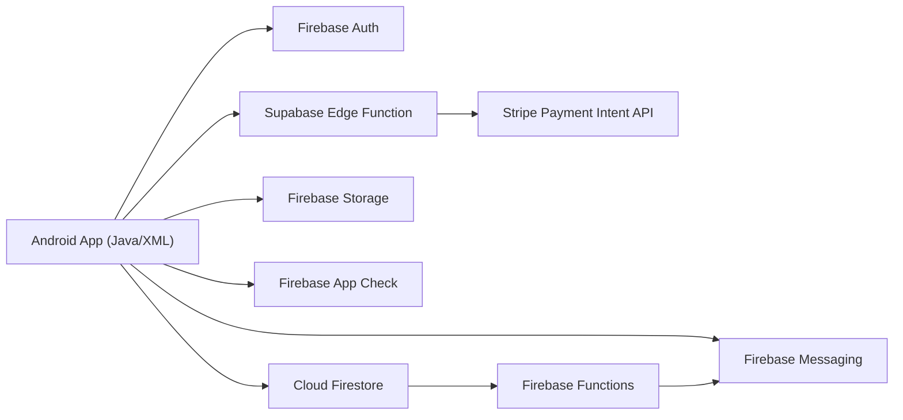

### Package Structure

- `model/`: domain entities such as `Event`, `User`, `Rsvp`, `Payment`, `Memory`, `SosAlert`
- `repository/`: Firestore-facing data and workflow orchestration
- `ui/`: role-specific activities and fragments
- `adapter/`: RecyclerView and list adapters
- `util/`: validators, payment utilities, QR helpers, theme helpers, walkthrough logic
- `callback/`: async interfaces used throughout the app

### Design Patterns Used

- **Repository pattern**: `EventRepository`, `PaymentRepository`, `SosRepository`
- **Adapter pattern**: RecyclerView adapters for events, attendees, notifications, tiers, memories, vendors
- **Service/helper separation**: `StripePaymentService`, `QRCodeHelper`, `CloudinaryHelper`, `ThemeManager`
- **Role-based navigation strategy**: `MainActivity` swaps home/action behavior by user role
- **Callback-driven async orchestration**: Firebase reads/writes and payment completion pathways
- **Transaction-based consistency**: RSVP, check-in, and some SOS-sensitive flows use Firestore transactions or batched writes

### Core Architectural Choices

- Android client remains the primary interaction layer.
- Firebase handles authentication, real-time persistence, messaging, rules, and cloud logic.
- Supabase Edge Functions are used to keep Stripe secret handling off-device.
- The product is designed as a modular but pragmatic prototype: a single Android app with clear package boundaries instead of a multi-module monorepo.

## UML Diagrams and Flowcharts

### Submission UML Bundle

These diagrams came from the supplied UML package and are now stored under `docs/images/uml/submission/`.

#### Application Architecture

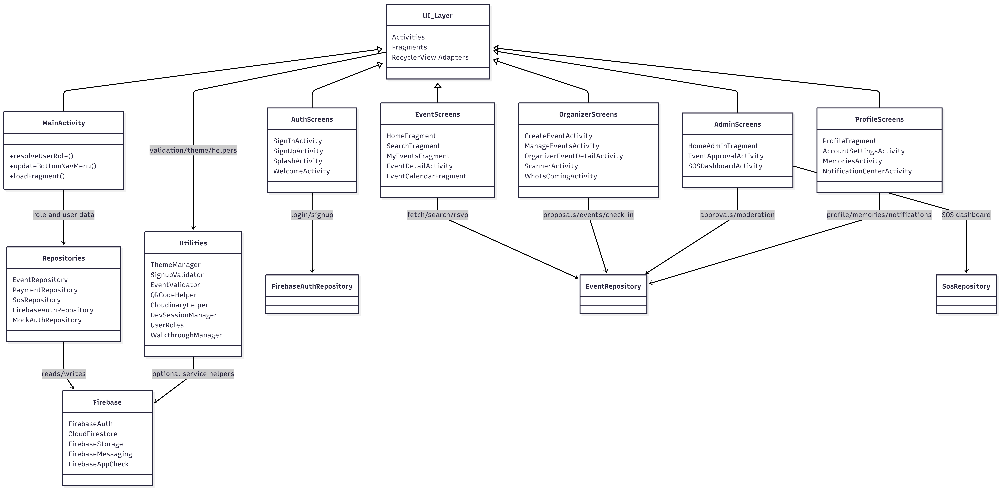

#### High-Level UML

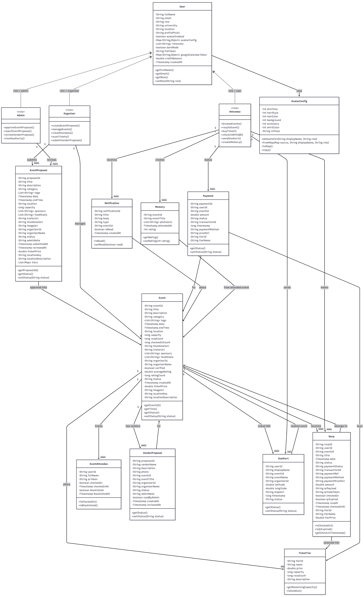

#### Authentication and Role-Based Navigation Flow

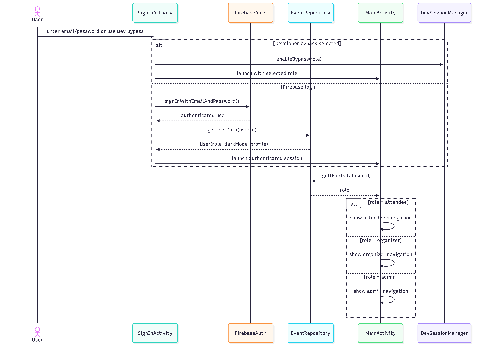

#### Event Proposal, Approval, and Publishing Flow

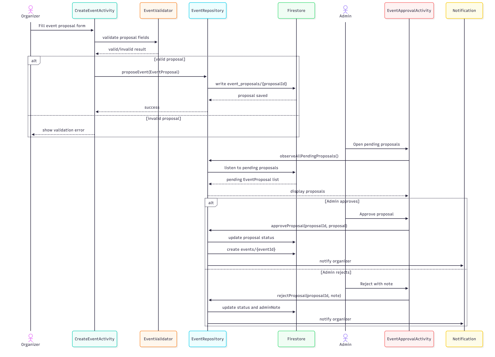

#### RSVP, Payment, and QR Ticketing Flow

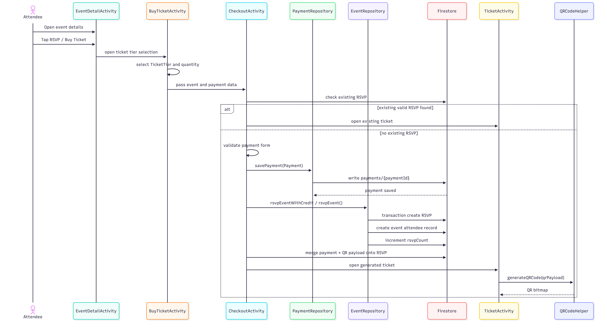

#### QR Check-In and Attendee Management Flow

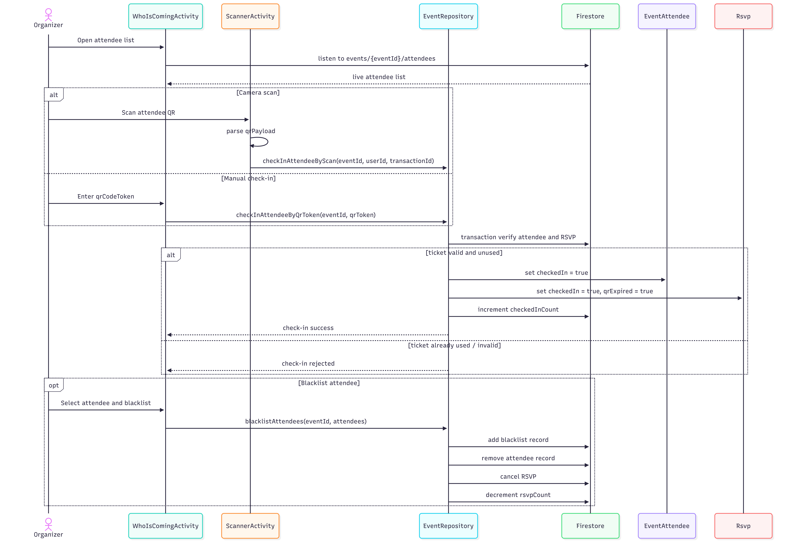

#### SOS and Vendor Management Flow

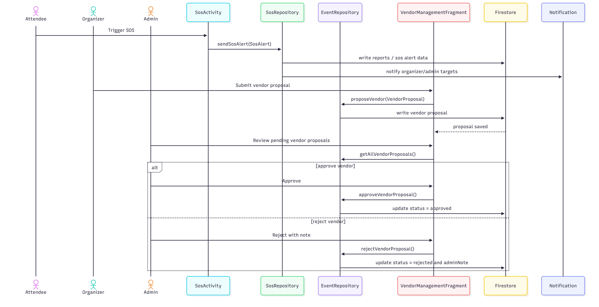

### Extended Class Diagrams From The Project

Additional class and slice-specific UML artifacts are available in [docs/images/uml](docs/images/uml), including:

- Authentication and event model
- Utility classes
- Admin layer
- Favourites fragment
- My Events fragment
- Search fragment
- Profile layer
- Event ticket purchase flow
- Event calendar fragment flow
- Event management home flow
- Event proposal creation flow

The original diagram-oriented write-up is preserved in [docs/phase3_README.md](docs/phase3_README.md).

### Process Flowcharts

#### Role-Aware App Entry

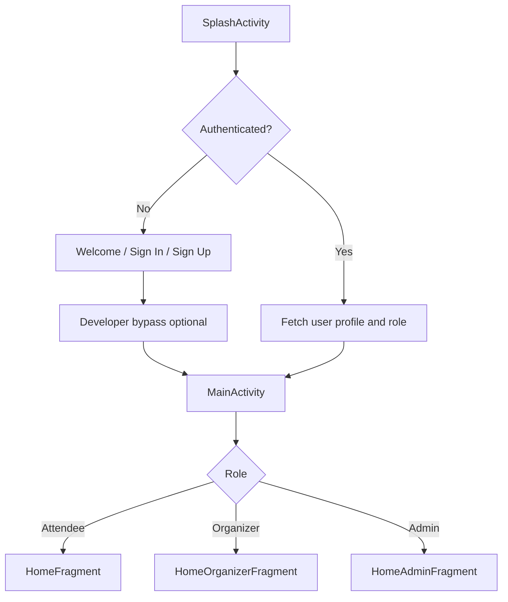

#### Event Proposal Lifecycle

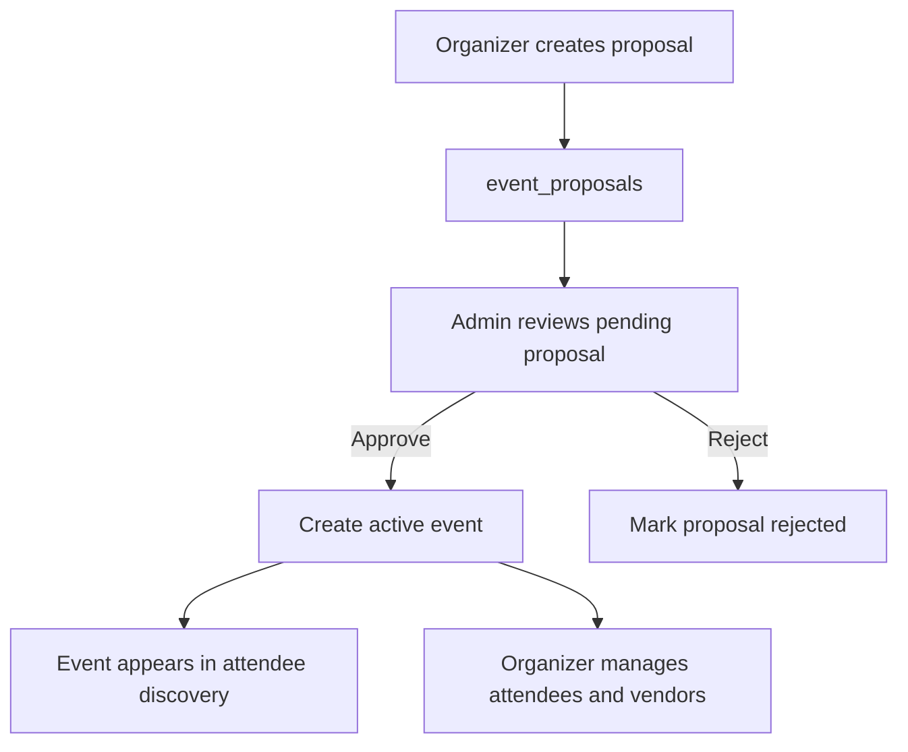

#### Ticketing and Attendance Flow

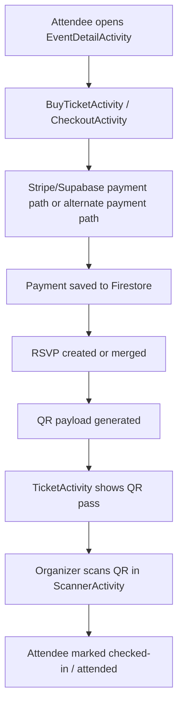

## Feature Implementation

### 1. Authentication, Startup, and Access Control

Implemented through:

- `SplashActivity`
- `WelcomeActivity`
- `SignInActivity`
- `SignUpActivity`
- `FirebaseAuthRepository`
- `MockAuthRepository`
- `DevBypassHelper`
- `DevSessionManager`
- `UserRoles`

How it works:

- Firebase Authentication handles normal email/password login and signup.
- `SignupValidator` centralizes email and password validation rules.
- `SplashActivity` and `MainActivity` determine startup routing.
- Developer bypass stores a mock role in `SharedPreferences` and allows rapid validation of attendee, organizer, and admin flows without real Firebase accounts.
- Role-aware navigation updates the bottom navigation and home fragment in `MainActivity`.

### 2. Event Discovery, Search, and Recommendations

Implemented through:

- `HomeFragment`
- `SearchFragment`
- `FavouritesFragment`
- `EventRepository`
- `Constants`

How it works:

- `HomeFragment` loads recent events, featured events, and personalized recommendations.
- Recommendation scoring uses user interests, recently viewed categories, RSVP popularity, and event timing.
- Search and filtering are routed through repository-backed Firestore queries plus client-side filtering/sorting where appropriate.
- Saved events are stored under `users/{uid}/saved_events`.

Related notes:

- [docs/README_AUTH_AND_PERSONALISED_CHANGES.md](docs/README_AUTH_AND_PERSONALISED_CHANGES.md)
- [docs/README_PERSONALISED_RECOMMENDATIONS.md](docs/README_PERSONALISED_RECOMMENDATIONS.md)

### 3. Event Creation, Proposal Review, and Publishing

Implemented through:

- `CreateEventActivity`
- `ManageEventsActivity`
- `OrganizerProposalDetailActivity`
- `EventApprovalActivity`
- `HomeAdminFragment`
- `EventRepository.proposeEvent(...)`
- `EventRepository.approveProposal(...)`
- `EventRepository.rejectProposal(...)`

How it works:

- Organizers fill proposal data including category, capacity, location, ticket data, and optional media.
- Images use Cloudinary-backed upload paths where configured.
- Proposals are written to `event_proposals`.
- Admin surfaces observe and review pending proposals.
- Approval creates publishable event data for the attendee-facing catalog.

### 4. RSVP, Payment, Ticket Tiers, and QR Ticketing

Implemented through:

- `EventDetailActivity`
- `BuyTicketActivity`
- `CheckoutActivity`
- `TicketActivity`
- `PaymentConfirmationActivity`
- `PaymentRepository`
- `StripePaymentService`
- `QRCodeHelper`
- `supabase/functions/create-payment-intent/index.ts`

How it works:

- Attendees enter ticket purchase from the event detail flow.
- Ticket tiers can be previewed and selected where available.
- `CheckoutActivity` prevents duplicate purchases by checking existing RSVP state before charging again.
- Payments are persisted to `payments`.
- Stripe payment intents are created through a Supabase Edge Function so the Stripe secret key never ships in the Android app.
- The RSVP document is merged with payment metadata and a QR payload after checkout success.
- `TicketActivity` renders the pass from the generated QR payload.

Supporting docs:

- [docs/STRIPE_SETUP.md](docs/STRIPE_SETUP.md)
- [docs/README_REMINDERS_AND_REFUNDS.md](docs/README_REMINDERS_AND_REFUNDS.md)
- [docs/REFUND_FIX_README.md](docs/REFUND_FIX_README.md)

### 5. Organizer Check-In, Attendance, and Blacklisting

Implemented through:

- `ScannerActivity`
- `TicketCaptureActivity`
- `WhoIsComingActivity`
- `AttendeeAdapter`
- `EventRepository.checkInAttendeeByQrToken(...)`
- `EventRepository.blacklistAttendees(...)`
- `EventRepository.isUserBlacklisted(...)`

How it works:

- QR scanning uses ZXing embedded capture.
- Organizers can inspect event attendees, search them, and apply blacklist actions.
- Check-in updates attendee and RSVP state, including one-time-use behavior for ticket flows.
- Blacklist data is stored under event-specific collections and checked before sensitive attendee actions.

### 6. SOS Incident Response

Implemented through:

- `SosActivity`
- `SOSDashboardActivity`
- `SOSAlertActivity`
- `SosRepository`
- `MyFirebaseMessagingService`
- `functions/index.js`

How it works:

- SOS access is gated by event context and check-in status.
- Location is requested through Play Services location APIs.
- Alerts are written to `sos_alerts`.
- Organizer/admin notifications are fanned out through Firestore notification documents and Firebase Functions multicast FCM.
- `SOSAlertActivity` supports a full-screen emergency alert experience on the receiving side.

Supporting docs:

- [docs/README_SOS.md](docs/README_SOS.md)
- [docs/sos_test_plan.md](docs/sos_test_plan.md)

### 7. Notifications, Event Reminders, and Messaging

Implemented through:

- `MyFirebaseMessagingService`
- `CampusEventDiscoveryApp`
- `NotificationCenterActivity`
- `functions/index.js`

How it works:

- The app persists user `fcmToken` values to Firestore.
- Firebase Functions schedule event reminder fan-out for upcoming active events.
- Reminder notifications route users into the calendar experience through destination-tab intent extras.
- Notification documents are shown in the in-app notification center.

Supporting docs:

- [docs/README_EVENT_REMINDERS_YAHYA.md](docs/README_EVENT_REMINDERS_YAHYA.md)

### 8. Profile, Memories, Walkthrough, and UI Personalization

Implemented through:

- `ProfileFragment`
- `AccountSettingsActivity`
- `MemoriesActivity`
- `MemoryAlbumActivity`
- `MemoryPhotoViewerActivity`
- `WalkthroughManager`
- `ThemeManager`
- `AvatarRenderer`

How it works:

- Users can update profile data and theme preferences.
- The app supports memory album creation, post-event photos, and ratings.
- Walkthrough mode and guided overlays support demoability and usability.
- Role-aware profile surfaces keep attendee and organizer/admin tools separated.

Supporting docs:

- [docs/MEMORY_MAP.md](docs/MEMORY_MAP.md)
- [docs/FRONTEND_CHANGE_NOTES.md](docs/FRONTEND_CHANGE_NOTES.md)

### 9. Vendor Coordination

Implemented through:

- `VendorManagementFragment`
- `VendorProposalAdapter`
- `VendorEventAdapter`
- vendor methods in `EventRepository`

How it works:

- Organizers can add and inspect vendors per event.
- Admins can review pending vendor requests.
- Vendor proposal state is managed in Firestore and displayed through role-sensitive surfaces.

## Firebase, Backend, and Infrastructure

### Firebase Services Used

- Firebase Authentication
- Cloud Firestore
- Firebase Storage
- Firebase Cloud Messaging
- Firebase App Check
- Firebase Functions

### Firestore Collections in Use

| Collection / Path | Purpose |
|---|---|
| `users/{uid}` | Profile, role, theme, interests, token, avatar, credit metadata |
| `users/{uid}/saved_events` | Favourites |
| `users/{uid}/rsvps` | RSVP, payment merge fields, QR payload, check-in status |
| `users/{uid}/memories` | Post-event memory albums and assets |
| `events/{eventId}` | Published event catalog |
| `events/{eventId}/attendees` | Attendance state for organizers and check-in flows |
| `events/{eventId}/ratings` | Ratings and feedback |
| `events/{eventId}/ticket_tiers` | Tiered ticket definitions |
| `events/{eventId}/blacklist` | Event-specific blacklist data |
| `event_proposals/{proposalId}` | Organizer-submitted proposals |
| `vendorProposals/{proposalId}` | Vendor workflows |
| `payments/{paymentId}` | Payment records |
| `credit_transactions/{transactionId}` | In-app credit audit trail |
| `notifications/{uid}/messages/{notificationId}` | In-app notification inbox |
| `sos_alerts/{alertId}` | Emergency alerts |
| `reports/{reportId}` | Historical/legacy report-compatible path retained in rules/docs |
| `app_config/{docId}` | Global configuration such as maintenance/featured settings |

### Firestore Rules and Indexes

- Rules file: [firestore.rules](firestore.rules)
- Index definitions: [firestore.indexes.json](firestore.indexes.json)

Notable rule coverage includes:

- signed-in user gating
- ownership checks for user-scoped data
- rating validation
- notification update constraints
- admin-only writes for `app_config`
- compatibility-friendly rules for flows that still write from trusted clients

### Firebase Functions

Configured in [firebase.json](firebase.json) and implemented in [functions/index.js](functions/index.js).

Current cloud functions include:

- `onSosAlertCreated`
  - triggers on `sos_alerts/{alertId}`
  - resolves organizer/admin recipients
  - sends data-only FCM multicast alerts
  - prunes invalid FCM tokens
- `sendEventReminders`
  - scheduled daily
  - finds upcoming active events inside the reminder window
  - fetches attendee tokens
  - sends reminder notifications that deep-link into the calendar flow

### App Check

The app enables:

- Play Integrity for release-grade checks
- Debug App Check for local development and team testing

### Storage and Media

- Firebase Storage remains part of the configured backend stack.
- Cloudinary is also used in the Android app for some image upload pathways, especially event/media-related workflows.

### Supabase and Stripe

The repository also includes a thin payment backend at:

- [supabase/functions/create-payment-intent/index.ts](supabase/functions/create-payment-intent/index.ts)

This function:

- receives checkout metadata
- validates amount
- creates a Stripe Payment Intent
- returns `clientSecret` and `paymentIntentId`
- keeps the Stripe secret key in environment variables rather than in the mobile app

## Testing and Quality Assurance

### Test Strategy

The project includes multiple layers of testing:

- **Unit tests** for model and utility logic
- **Repository and integration-style tests** for Firestore-facing workflows
- **Contract tests** for UI/state assumptions and feature boundaries
- **Instrumented Android tests** for real navigation and screen behavior
- **Manual scenario testing** for flows that require device services, notifications, or emergency UX

### Test Inventory

Current test inventory in the repository:

- `44` local tests under `app/src/test/java`
- `8` instrumented tests under `app/src/androidTest/java`

Examples of automated coverage include:

- `AuthRepositoryTest`
- `SignupValidatorTest`
- `EventRepositoryTest`
- `EventRepositoryPersonalisationTest`
- `PaymentRepositoryTest`
- `PaymentFlowIntegrationTest`
- `StripePaymentServiceTest`
- `RefundPolicyTest`
- `SosRepositoryTest`
- `SosEligibilityTest`
- `VendorManagementContractTest`
- `SystemJourneyInstrumentedTest`
- `NavigationSurfacesInstrumentedTest`
- `WalkthroughManagerInstrumentedTest`

### Test Commands

```bash
./gradlew testDebugUnitTest
./gradlew connectedDebugAndroidTest
```

Convenience script:

```bash
./scripts/run_android_test_suites.sh
```

### Manual and Scenario-Based Testing

The repo also preserves structured manual test plans and evidence-oriented test writing:

- [docs/testing_coverage_report.md](docs/testing_coverage_report.md)
- [docs/sos_test_plan.md](docs/sos_test_plan.md)

These cover:

- auth and startup
- recommendation behavior
- payment and refund scenarios
- SOS eligibility and alert propagation
- vendor and organizer surfaces
- memory and profile workflows
- navigation and layout contracts

### Quality Notes

- The test suite is substantial and runnable from the repository.
- Historical testing notes and current gaps are documented in [docs/testing_coverage_report.md](docs/testing_coverage_report.md).
- This README does not claim a fresh green run in this edit; it documents the test assets and strategy currently present in the repo.

## Sprint Planning, Reviews, and GitHub Workflow

The project was managed through staged GitHub-based collaboration rather than informal file exchange.

Evidence preserved in-repo:

- [docs/github_4_stage_breakdown.md](docs/github_4_stage_breakdown.md)
- [docs/conflicts_nausherwan.md](docs/conflicts_nausherwan.md)
- [docs/conflicts_yahya.md](docs/conflicts_yahya.md)
- [docs/PROJECT_CHANGELOG.md](docs/PROJECT_CHANGELOG.md)

Board and issue visuals:


What this demonstrates:

- weekly sprint slicing
- task ownership and merge coordination
- issue tracking and closure discipline
- evidence of iterative review and integration

## Repository Structure

```text
.
├── app/                         Android application source
├── docs/                        Submission docs, archived phase docs, tests, diagrams, notes
├── functions/                   Firebase Cloud Functions
├── supabase/                    Stripe payment intent edge function
├── scripts/                     Test execution helpers
├── firebase.json                Firebase deployment config
├── firestore.indexes.json       Firestore index definitions
├── firestore.rules              Firestore security rules
├── build.gradle.kts             Root Gradle config
└── README.md                    Final submission README
```

## Setup and Run

### Prerequisites

- Android Studio Ladybug or newer
- JDK 11
- Android SDK with `minSdk 24`, `targetSdk 34`, `compileSdk 36`
- Firebase project with Auth, Firestore, Storage, Messaging, and App Check enabled
- `google-services.json` placed at `app/google-services.json`

### Build the App

```bash
./gradlew assembleDebug
```

### Run Automated Tests

```bash
./gradlew testDebugUnitTest
./gradlew connectedDebugAndroidTest
```

### Firebase Functions

```bash
cd functions
npm install
firebase deploy --only functions
```

### Supabase Stripe Function

Stripe setup notes are documented in [docs/STRIPE_SETUP.md](docs/STRIPE_SETUP.md).

### Developer Bypass for Demo and QA

For review, live demo, and rapid QA:

- open sign-in or sign-up
- use the developer bypass option
- choose `attendee`, `organizer`, or `admin`
- validate role-specific flows without creating multiple real accounts

## Supporting Documentation

### Archived and Phase Documentation

- [docs/phase3_README.md](docs/phase3_README.md)
- [docs/PROJECT_CHANGELOG.md](docs/PROJECT_CHANGELOG.md)
- [docs/Important_improvements.md](docs/Important_improvements.md)
- [docs/README_DIFF.md](docs/README_DIFF.md)
- [docs/README_PROJECT_COMPARISON.md](docs/README_PROJECT_COMPARISON.md)

### Feature-Specific Notes

- [docs/README_AUTH_AND_PERSONALISED_CHANGES.md](docs/README_AUTH_AND_PERSONALISED_CHANGES.md)
- [docs/README_PERSONALISED_RECOMMENDATIONS.md](docs/README_PERSONALISED_RECOMMENDATIONS.md)
- [docs/README_EVENT_REMINDERS_YAHYA.md](docs/README_EVENT_REMINDERS_YAHYA.md)
- [docs/README_REMINDERS_AND_REFUNDS.md](docs/README_REMINDERS_AND_REFUNDS.md)
- [docs/README_SOS.md](docs/README_SOS.md)
- [docs/REFUND_FIX_README.md](docs/REFUND_FIX_README.md)
- [docs/STRIPE_SETUP.md](docs/STRIPE_SETUP.md)
- [docs/MEMORY_MAP.md](docs/MEMORY_MAP.md)
- [docs/FRONTEND_CHANGE_NOTES.md](docs/FRONTEND_CHANGE_NOTES.md)

### Testing, Database, and Integration Notes

- [docs/testing_coverage_report.md](docs/testing_coverage_report.md)
- [docs/sos_test_plan.md](docs/sos_test_plan.md)
- [docs/db/initial_db.txt](docs/db/initial_db.txt)
- [docs/readme_content_inventory.md](docs/readme_content_inventory.md)

### Javadoc

Javadoc is being maintained separately by a teammate and is therefore not expanded in this README. Existing generated output, where present, remains under [docs/javadoc](docs/javadoc).

## Team

**LUMS, CS360 Software Engineering, Spring 2026**

| Member | Responsibility Area |
|---|---|
| Saad | Scrum leadership, integration, documentation coordination, Firebase/auth/payment/check-in flows |
| Ammar | Core architecture and project ownership |
| Hussain | Event and RSVP domain contributions |
| Yahya | Discovery, reminders, database-oriented and repository-oriented work |
| Nausherwan | Organizer/event-management, map/tier workflows, extended test-facing implementation |

Repository:

- [CS360S26gemini/Campus-Event-Discovery-and-Management-Platform](https://github.com/CS360S26gemini/Campus-Event-Discovery-and-Management-Platform)

---

This README is now the primary release and submission document for the project. Historical or feature-specific notes have been preserved under [docs/](docs/) so the root stays focused, professional, and reviewer-friendly.
