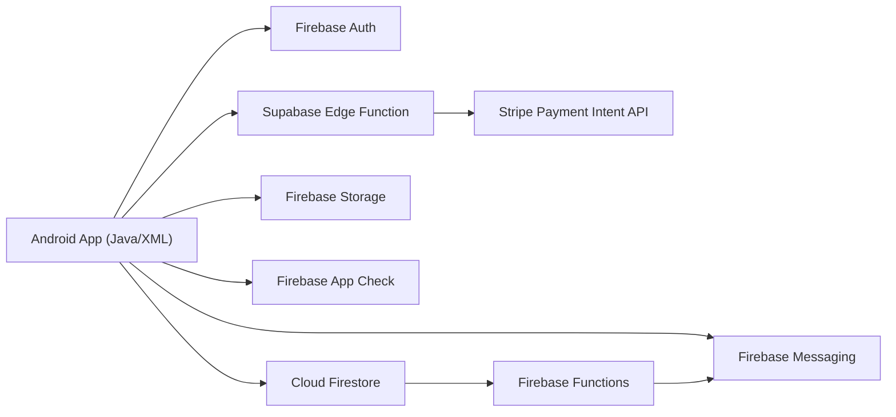
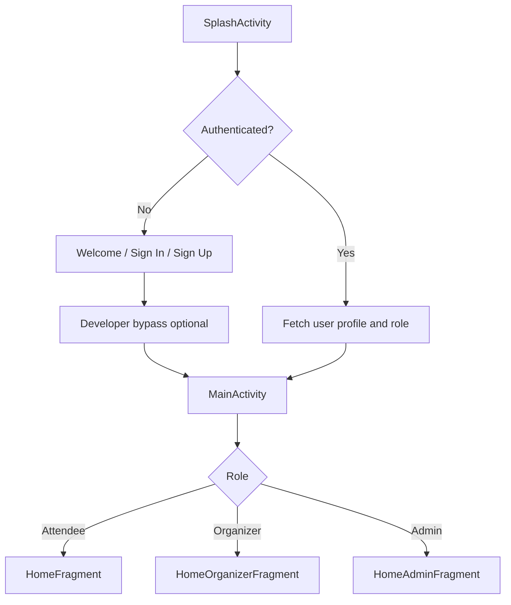
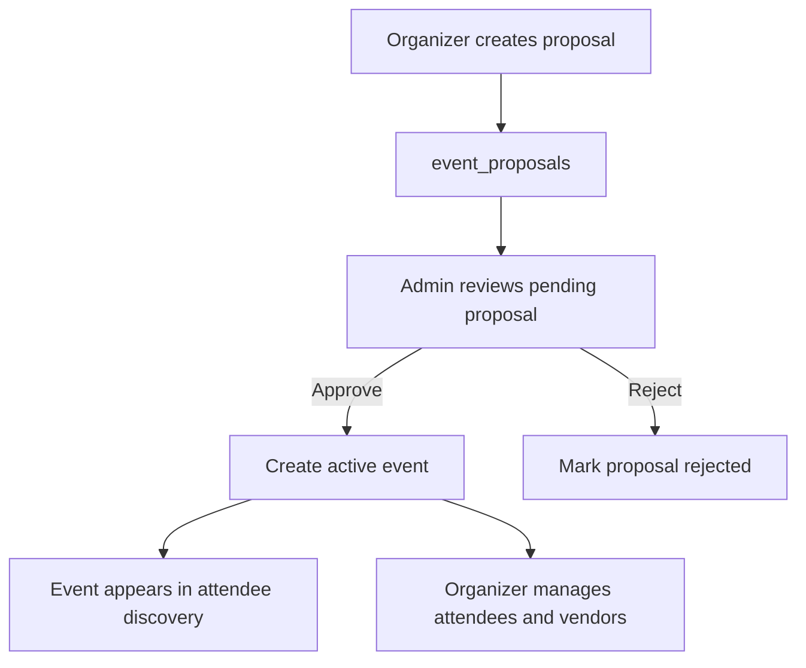
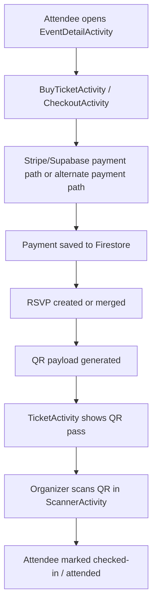

# EventHub: Campus Event Discovery and Management Platform

> A release-ready Android platform for campus event discovery, RSVP and ticketing, organizer workflows, admin moderation, SOS escalation, reminders, and vendor coordination.

**Platform:** Android (Java + XML)  
**Primary Backend:** Firebase  
**Payments:** Stripe via Supabase Edge Function  
**Current State:** Final prototype ready for submission, demo, and release evaluation

## Table of Contents

1. [Release Snapshot](#release-snapshot)
2. [Submission Deliverables Mapping](#submission-deliverables-mapping)
3. [Product Overview](#product-overview)
4. [Design, Mockups, and Storyboards](#design-mockups-and-storyboards)
5. [User Stories and Backlog Status](#user-stories-and-backlog-status)
6. [System Architecture and Object-Oriented Design](#system-architecture-and-object-oriented-design)
7. [UML Diagrams and Flowcharts](#uml-diagrams-and-flowcharts)
8. [Feature Implementation](#feature-implementation)
9. [Firebase, Backend, and Infrastructure](#firebase-backend-and-infrastructure)
10. [Testing and Quality Assurance](#testing-and-quality-assurance)
11. [Sprint Planning, Reviews, and GitHub Workflow](#sprint-planning-reviews-and-github-workflow)
12. [Repository Structure](#repository-structure)
13. [Setup and Run](#setup-and-run)
14. [Supporting Documentation](#supporting-documentation)
15. [Team](#team)

## Release Snapshot

EventHub is a three-sided campus platform built for LUMS that serves:

- **Attendees** who browse, search, save, RSVP, pay, receive reminders, access tickets, submit feedback, and manage memories.
- **Organizers** who create proposals, manage approved events, scan attendees, blacklist abusive users, coordinate vendors, and monitor SOS incidents tied to their events.
- **Admins** who review proposals, approve or reject content, review vendor requests, monitor platform activity, and control maintenance-related configuration.

The repository now includes:

- A final submission README at the project root.
- The previous phase README preserved as [docs/phase3_README.md](docs/phase3_README.md).
- Supplemental implementation notes moved into [docs/](docs/).
- UML diagrams, storyboard images, GitHub board screenshots, database notes, and testing plans under [docs/images](docs/images) and [docs/](docs/).

## Submission Deliverables Mapping

This README is written to map directly to the final submission requirements.

| Deliverable | Where It Is Covered |
|---|---|
| Addressing feedback | [docs/README_BUG.md](docs/README_BUG.md), [docs/README_DIFF.md](docs/README_DIFF.md), [docs/Important_improvements.md](docs/Important_improvements.md), [docs/PROJECT_CHANGELOG.md](docs/PROJECT_CHANGELOG.md) |
| Code base of prototype | `app/`, `functions/`, `supabase/`, Gradle build files, Firebase config files |
| Code documentation | Source file headers and inline comments in codebase; Javadoc work is being maintained separately and is intentionally not duplicated here |
| Test cases | `app/src/test/java/`, `app/src/androidTest/java/`, [docs/testing_coverage_report.md](docs/testing_coverage_report.md), [docs/sos_test_plan.md](docs/sos_test_plan.md) |
| Object-oriented design | UML diagrams in this README and under [docs/images/uml](docs/images/uml) |
| Product backlog | User story summary in this README, sprint breakdown in [docs/github_4_stage_breakdown.md](docs/github_4_stage_breakdown.md) |
| UI mockups and storyboards | Figma plus storyboard images in [docs/images](docs/images) |
| Sprint planning and reviews | GitHub issue board screenshots and change-tracking docs in [docs/images](docs/images) and [docs/](docs/) |
| Demonstration readiness | Feature walkthroughs, release flows, and testable setup in this README |
| Tool use / GitHub workflow | Board screenshots and stage breakdown docs under [docs/](docs/) |

## Product Overview

### Problem

Campus events are often fragmented across informal channels, making it difficult for students to discover relevant opportunities, for organizers to manage event operations, and for administrators to enforce quality and safety controls from one place.

### Solution

EventHub centralizes:

- event discovery
- recommendations
- RSVP and payment
- QR ticketing and check-in
- proposal submission and approval
- attendee management
- SOS incident reporting
- reminder notifications
- vendor workflows
- post-event memories and feedback

### Primary Roles

| Role | Core Capabilities |
|---|---|
| Attendee | Discover events, save favourites, RSVP, purchase tickets, receive reminders, access QR tickets, submit ratings/feedback, build memories, trigger SOS when eligible |
| Organizer | Submit event proposals, manage approved events, inspect attendees, scan QR tickets, blacklist attendees, send announcements, coordinate vendors |
| Admin | Review proposals, handle moderation-facing surfaces, review vendor requests, manage system-level visibility and release operations |

### Product Highlights

- Role-aware startup and navigation
- Personalized recommendations based on interests and recently viewed categories
- Ticket tiers and checkout support
- QR payload generation and organizer-side validation
- SOS flows backed by location, event context, and push notifications
- Firebase Cloud Messaging reminders routed into the calendar experience
- Memory albums, profile customization, and walkthrough guidance

## Design, Mockups, and Storyboards

### Figma

- Final design file: [EventHub Final Figma](https://www.figma.com/design/KXUYkTVUYQjx3P8eLzw2MO/EventHub-Final?node-id=15-4868&m=dev&t=PqeX4jiICtlC3YX2-1)

### Storyboards and UI Artifacts

The UI direction evolved from storyboard-level planning into high-fidelity screens and then into the implemented Android flows.

Representative storyboard and planning images already tracked in-repo:

.png>)
.png>)
.png>)

Additional visual references:

- [docs/images/create_event.png](docs/images/create_event.png)
- [docs/images/Screenshot_2026-03-10_111125.png](docs/images/Screenshot_2026-03-10_111125.png)
- [docs/images/project_board_overview.png](docs/images/project_board_overview.png)

### Design to Implementation Traceability

- Mockups and storyboards establish the intended UX.
- XML layouts under `app/src/main/res/layout/` implement those screens.
- Activities and fragments under `app/src/main/java/com/example/CampusEventDiscovery/ui/` execute the behavior.
- Visual refinement notes are preserved in [docs/FRONTEND_CHANGE_NOTES.md](docs/FRONTEND_CHANGE_NOTES.md).

## User Stories and Backlog Status

The backlog section below was expanded by cross-checking the implemented app code against the GitHub board/issues for `CS360S26gemini/Campus-Event-Discovery-and-Management-Platform`. Where the board had duplicates or implementation sub-tasks, related items were consolidated into one reviewer-friendly product story while preserving the original feature intent.

| User Story / Backlog Item | Status | Primary Implementation Touchpoints | GitHub Board / Issue Origin |
|---|---|---|---|
| As a student, I want to browse upcoming campus events so that I can discover what is happening on campus | Done | `HomeFragment`, `EventRepository.getUpcomingEvents(...)`, `EventAdapter` | `US-01` issue `#6` |
| As a user, I want personalised suggestions based on my interests so that relevant events surface first | Done | `HomeFragment`, `EventRepository.getScoredRecommendations(...)`, `SignupValidator`, `AccountSettingsActivity` | `US-02` issue `#9`, personalization follow-up `#122` |
| As a user, I want dark mode so the app is easier on the eyes and consistent across screens | Done | `ThemeManager`, `AccountSettingsActivity`, `CampusEventDiscoveryApp` | `US-04` issue `#11` |
| As a user, I want reminder notifications so I do not miss events I registered for | Done | `MyFirebaseMessagingService`, `functions/index.js`, `MainActivity`, `EventCalendarFragment` | `US-05` issue `#12`, reminder workflow issues `#130`, `#141` |
| As an organizer, I want to propose events so that they can be reviewed and published to the platform | Done | `CreateEventActivity`, `EventRepository.proposeEvent(...)`, `EventValidator` | `US-07` issue `#14` |
| As a user attending an event, I want SOS support so that organizers/admins can be alerted in an emergency | Done | `SosActivity`, `SOSDashboardActivity`, `SOSAlertActivity`, `SosRepository`, `functions/index.js` | `US-09` issue `#16`, SOS implementation issue `#84` |
| As a user, I want to purchase tickets safely and receive proof of registration so I can access paid events | Done | `BuyTicketActivity`, `CheckoutActivity`, `TicketActivity`, `PaymentRepository`, `StripePaymentService` | `US-13` issue `#26`, QR/payment epic `#80` |
| As a student, I want to sign up for a new account so I can use the platform and personalize my experience | Done | `SignUpActivity`, `FirebaseAuthRepository`, `SignupValidator`, `User` | `US-15` issue `#29` |
| As a student, I want to unregister from an event so I can free my schedule and release my spot | Done | `MyEventsFragment`, `EventRepository.cancelRsvp(...)` | `US-18` issue `#33`, refund-related follow-up `#87` |
| As a student, I want to see remaining spots so I know whether an event still has capacity | Done | `EventDetailActivity`, `HomeFragment`, `EventRepository.rsvpEvent(...)` | `US-19` issue `#34`, RSVP issue `#44` |
| As an organizer, I want to track registrations against capacity so I can manage logistics and popularity | Done | `OrganizerEventDetailActivity`, `WhoIsComingActivity`, `EventRepository.getEventAttendees(...)` | `US-20` issue `#35` |
| As a student, I want filterable event search so I can narrow results by category and relevance | Done | `SearchFragment`, `EventRepository.searchEvents(...)` | `US-21` issue `#36` |
| As a user, I want to search events by name so I can quickly find a specific activity | Done | `SearchFragment`, `EventAdapter` | `US-23` issue `#38` |
| As an attendee, I want RSVP creation to be transactional so duplicates, overbooking, and invalid registrations are prevented | Done | `EventRepository.rsvpEvent(...)`, `EventDetailActivity`, `MyEventsFragment` | RSVP issue `#44`, role-flow issue `#62` |
| As a user, I want secure login to my existing account so that my profile and preferences persist across sessions | Done | `SignInActivity`, `FirebaseAuthRepository`, `AuthPreferenceManager` | login issue `#28`, auth DB issue `#76` |
| As an attendee, I want favourites so I can save events and revisit them later without losing sync when events are deleted | Done | `FavouritesFragment`, `EventRepository.saveEvent(...)`, `EventRepository.getSavedEvents(...)` | favourites issues `#121`, `#129`, organizer/admin removal issue `#138` |
| As an organizer, I want to upload event images/thumbnails so attendees can see richer event listings | Done | `CreateEventActivity`, `CloudinaryHelper`, `EventProposal`, Glide-backed UI surfaces | event image issues `#79`, `#111`, `#112` |
| As a user, I want QR ticketing so my registration can be validated quickly at the venue | Done | `TicketActivity`, `QRCodeHelper`, `CheckoutActivity`, `Rsvp` | payment + QR epic `#80`, RSVP model issue `#113` |
| As an organizer, I want to scan and validate tickets so that only valid attendees are checked in once | Done | `ScannerActivity`, `TicketCaptureActivity`, `EventRepository.checkInAttendeeByQrToken(...)`, `EventRepository.checkInAttendeeByScan(...)` | check-in validation issue `#109`, QR epic `#80` |
| As an organizer, I want to view payments and total revenue so I can verify incoming money for my event | Done | `PaymentConfirmationActivity`, `PaymentRepository.getPaymentsForEvent(...)` | payment verification issue `#81`, organizer payment view issues `#116`, `#117`, `#148`, `#149` |
| As an attendee, I want multiple payment pathways, including proof-based flows, so checkout is flexible | Done | `CheckoutActivity`, `Payment`, `Rsvp`, `StripePaymentService` | payment proof / gateway issues `#82`, `#102`, `#113`, `#114` |
| As a user, I want in-app credit refunds so eligible cancellations return value that can be reused later | Done | `EventRepository.cancelRsvp(...)`, `EventRepository.rsvpEventWithCredit(...)`, `AccountSettingsActivity`, `CheckoutActivity` | refund/credit issues `#142`, `#143`, `#144`, `#145`, `#146` |
| As a user, I want to view the event’s campus location clearly so I can navigate to the venue | Done | `CampusMapActivity`, `EventDetailActivity`, location constants in `Constants` | campus map issue `#118` |
| As an organizer, I want a dashboard for my event operations so I can monitor proposals, vendors, and event state | Done | `HomeOrganizerFragment`, `ManageEventsActivity`, `OrganizerEventDetailActivity`, `VendorManagementFragment` | organizer dashboard issues `#119`, `#126`, `#127` |
| As an organizer or admin, I want vendor-management workflows so I can request, review, and track vendors tied to events | Done | `VendorManagementFragment`, `VendorProposalAdapter`, vendor methods in `EventRepository` | vendor/dashboard issues `#119`, `#127`, UI consistency issue `#137` |
| As a user, I want a better onboarding/auth cross-navigation flow so I can move smoothly between welcome, sign-in, and sign-up | Done | `WelcomeActivity`, `SignInActivity`, `SignUpActivity` | welcome/auth issues `#120`, `#134` |
| As a user, I want a Help and Support page with guided walkthroughs so I can learn core features by role | Done | `HelpFragment`, `WalkthroughManager`, walkthrough-linked UI surfaces | help issue `#123` |
| As an attendee, I want a memories system so I can keep albums and revisit attended-event moments | Done | `MemoriesActivity`, `MemoryAlbumActivity`, `MemoryPhotoViewerActivity`, `EventRepository.createMemoryAlbum(...)` | memories issue `#124` |
| As an organizer, I want ticket tiers and differentiated pricing so different attendee segments can buy appropriate access levels | Done | `CreateEventActivity`, `BuyTicketActivity`, `TicketTierAdapter`, `TicketTierOptionAdapter` | ticket-tier issue `#128` |
| As a user, I want remembered email and stronger sign-in usability features so repeated sign-in is easier but still secure | Done | `SignInActivity`, `AuthPreferenceManager`, `SignupValidator` | remember-me issue `#139` |
| As a tester or teammate, I want a developer bypass so I can validate all role-specific flows quickly without creating multiple real accounts | Done | `DevBypassHelper`, `DevSessionManager`, `MainActivity` | implemented product need, reflected in code and sprint integration work |

Backlog and stage-oriented planning references:

- [docs/github_4_stage_breakdown.md](docs/github_4_stage_breakdown.md)
- [docs/PROJECT_CHANGELOG.md](docs/PROJECT_CHANGELOG.md)
- [docs/phase3_README.md](docs/phase3_README.md)

## System Architecture and Object-Oriented Design

### High-Level Architecture



### Package Structure

- `model/`: domain entities such as `Event`, `User`, `Rsvp`, `Payment`, `Memory`, `SosAlert`
- `repository/`: Firestore-facing data and workflow orchestration
- `ui/`: role-specific activities and fragments
- `adapter/`: RecyclerView and list adapters
- `util/`: validators, payment utilities, QR helpers, theme helpers, walkthrough logic
- `callback/`: async interfaces used throughout the app

### Design Patterns Used

- **Repository pattern**: `EventRepository`, `PaymentRepository`, `SosRepository`
- **Adapter pattern**: RecyclerView adapters for events, attendees, notifications, tiers, memories, vendors
- **Service/helper separation**: `StripePaymentService`, `QRCodeHelper`, `CloudinaryHelper`, `ThemeManager`
- **Role-based navigation strategy**: `MainActivity` swaps home/action behavior by user role
- **Callback-driven async orchestration**: Firebase reads/writes and payment completion pathways
- **Transaction-based consistency**: RSVP, check-in, and some SOS-sensitive flows use Firestore transactions or batched writes

### Core Architectural Choices

- Android client remains the primary interaction layer.
- Firebase handles authentication, real-time persistence, messaging, rules, and cloud logic.
- Supabase Edge Functions are used to keep Stripe secret handling off-device.
- The product is designed as a modular but pragmatic prototype: a single Android app with clear package boundaries instead of a multi-module monorepo.

## UML Diagrams and Flowcharts

### Submission UML Bundle

These diagrams came from the supplied UML package and are now stored under `docs/images/uml/submission/`.

#### Application Architecture


#### High-Level UML


#### Authentication and Role-Based Navigation Flow


#### Event Proposal, Approval, and Publishing Flow


#### RSVP, Payment, and QR Ticketing Flow


#### QR Check-In and Attendee Management Flow


#### SOS and Vendor Management Flow


### Extended Class Diagrams From The Project

Additional class and slice-specific UML artifacts are available in [docs/images/uml](docs/images/uml), including:

- Authentication and event model
- Utility classes
- Admin layer
- Favourites fragment
- My Events fragment
- Search fragment
- Profile layer
- Event ticket purchase flow
- Event calendar fragment flow
- Event management home flow
- Event proposal creation flow

The original diagram-oriented write-up is preserved in [docs/phase3_README.md](docs/phase3_README.md).

### Process Flowcharts

#### Role-Aware App Entry



#### Event Proposal Lifecycle



#### Ticketing and Attendance Flow



## Feature Implementation

### 1. Authentication, Startup, and Access Control

**Primary files**

- `SplashActivity`
- `WelcomeActivity`
- `SignInActivity`
- `SignUpActivity`
- `FirebaseAuthRepository`
- `MockAuthRepository`
- `SignupValidator`
- `DevBypassHelper`
- `DevSessionManager`
- `UserRoles`
- `MainActivity`

**End-to-end flow**

1. The app launches through `SplashActivity`.
2. `SplashActivity` checks for a real Firebase session and then consults maintenance-mode state from Firestore.
3. If there is no authenticated user, the app routes to `WelcomeActivity`, then to `SignInActivity` or `SignUpActivity`.
4. On sign-in, Firebase Auth validates credentials and `EventRepository.getUserData(...)` loads the Firestore profile for role and theme synchronization.
5. `MainActivity` resolves the effective role and mutates the bottom navigation, home screen, and action behavior accordingly.
6. For demos and QA, the developer bypass can inject a local attendee, organizer, or admin session without creating a live Firebase account.

**Implementation details**

- `FirebaseAuthRepository` abstracts signup/login so UI classes are not tightly coupled to raw Firebase SDK calls.
- `SignupValidator` enforces email formatting and strong password policy before network calls.
- Sign-in includes `Forgot Password`, `Remember Me`, verification handling, and clearer error routing.
- Role comparisons are centralized in `UserRoles` instead of being scattered as raw string literals.
- `DevSessionManager` stores bypass state in `SharedPreferences` and only activates it when there is no real Firebase session, avoiding accidental role override.

**Data touched**

- `users/{uid}` for profile, role, interests, dark mode, and device metadata
- local `SharedPreferences` for developer bypass and remembered email

**Supporting docs**

- [docs/README_AUTH_AND_PERSONALISED_CHANGES.md](docs/README_AUTH_AND_PERSONALISED_CHANGES.md)
- [docs/phase3_README.md](docs/phase3_README.md)

### 2. Event Discovery, Search, Favourites, and Recommendations

**Primary files**

- `HomeFragment`
- `SearchFragment`
- `FavouritesFragment`
- `MyEventsFragment`
- `EventDetailActivity`
- `EventRepository`

**End-to-end flow**

1. `HomeFragment` loads active events for the attendee landing experience.
2. The repository loads featured event IDs from app configuration and resolves full event documents.
3. Personalized recommendations are computed from user interests, recently viewed categories, event popularity, and event date proximity.
4. If no personalized score is meaningful, the system falls back to a trending-style feed instead of showing an empty recommendation strip.
5. `SearchFragment` lets users search and filter active events.
6. Users can save events to favourites and later revisit them in `FavouritesFragment`.
7. Opening an event leads to `EventDetailActivity`, which becomes the central handoff point for RSVP, ticketing, maps, feedback, and SOS eligibility.

**Implementation details**

- Recommendation logic is deterministic and uses only existing app data; no external AI or recommendation API is used.
- Recently viewed categories are tracked locally and fed back into ranking.
- Past events are excluded from the recommendation pool.
- Saved events are denormalized into `users/{uid}/saved_events` for faster user-facing retrieval.
- `MyEventsFragment` serves both attendee and organizer cases, changing behavior depending on role.

**Data touched**

- `events/{eventId}`
- `users/{uid}/saved_events`
- local preferences for recently viewed event IDs/categories

**Supporting docs**

- [docs/README_AUTH_AND_PERSONALISED_CHANGES.md](docs/README_AUTH_AND_PERSONALISED_CHANGES.md)
- [docs/README_PERSONALISED_RECOMMENDATIONS.md](docs/README_PERSONALISED_RECOMMENDATIONS.md)

### 3. Event Proposal Creation, Admin Review, and Publishing

**Primary files**

- `CreateEventActivity`
- `ManageEventsActivity`
- `OrganizerProposalDetailActivity`
- `OrganizerEventDetailActivity`
- `EventApprovalActivity`
- `HomeOrganizerFragment`
- `HomeAdminFragment`
- `EventRepository`

**End-to-end flow**

1. An organizer creates a proposal in `CreateEventActivity`.
2. The app validates title, description, category, capacity, date, organizer identity, location, and optional ticket-related inputs.
3. Media uploads are routed through configured image upload helpers where applicable.
4. The proposal is written to `event_proposals`.
5. Organizers can inspect proposal status in their management surfaces.
6. Admins observe pending proposals in real time and open `EventApprovalActivity` for decision-making.
7. Approval promotes proposal data into a publishable event record; rejection writes status and note data while notifying the organizer.

**Implementation details**

- Proposal creation supports category, capacity, tags/interests, map location data, and tier-aware event setup depending on feature slice.
- `HomeAdminFragment` uses a real-time observation pattern so new pending proposals surface without manual refresh.
- `ManageEventsActivity` separates approved, pending, and rejected organizer items so workflow state is visible.
- Proposal approval and rejection logic is centralized in repository methods to keep lifecycle rules out of UI code.

**Data touched**

- `event_proposals/{proposalId}`
- `events/{eventId}`
- `notifications/{uid}/messages/{notificationId}`

### 4. RSVP, Payments, Ticket Tiers, Refunds, and QR Ticketing

**Primary files**

- `EventDetailActivity`
- `BuyTicketActivity`
- `CheckoutActivity`
- `TicketActivity`
- `PaymentConfirmationActivity`
- `PaymentRepository`
- `StripePaymentService`
- `QRCodeHelper`
- `EventRepository`
- `supabase/functions/create-payment-intent/index.ts`

**End-to-end flow**

1. The attendee opens `EventDetailActivity`.
2. If the event is paid or tiered, `BuyTicketActivity` or tier selection UI determines the attendee’s pricing path.
3. `CheckoutActivity` loads attendee details, selected tier, available in-app credits, and payment options.
4. Before charging, checkout checks whether the attendee already has a valid RSVP/ticket to prevent duplicate purchases.
5. For Stripe-backed checkout, the app requests a payment intent through the Supabase Edge Function.
6. Payment metadata is saved to Firestore via `PaymentRepository`.
7. RSVP creation is performed through transactional repository logic that checks capacity, blacklist status, and duplicate registration.
8. After RSVP success, payment metadata and QR payload data are merged onto the RSVP document.
9. `TicketActivity` generates and displays the QR code pass used later for organizer scanning.
10. Refund and in-app credit logic handles eligible attendee cancellations and organizer cancellations by returning value as platform credits.

**Implementation details**

- Duplicate RSVP prevention occurs before new charges and again inside repository-level RSVP protection logic.
- The payment pipeline is intentionally structured like a production checkout even where some demo behaviors remain.
- `StripePaymentService` keeps secret handling off-device by talking to a Supabase Edge Function instead of directly embedding a secret key in Android.
- Refund policy is time-sensitive for attendee cancellations and unconditional for organizer-driven event cancellation.
- In-app credits are atomic: repository transactions deduct credits, create audit records, and prevent overspending.
- Ticket tiers are surfaced in both organizer creation and attendee purchase flows, with the lowest valid tier often driving summary display.

**Data touched**

- `payments/{paymentId}`
- `users/{uid}/rsvps/{eventId}`
- `events/{eventId}/attendees/{uid}`
- `credit_transactions/{transactionId}`
- `users/{uid}.creditBalance`

**Supporting docs**

- [docs/STRIPE_SETUP.md](docs/STRIPE_SETUP.md)
- [docs/README_REMINDERS_AND_REFUNDS.md](docs/README_REMINDERS_AND_REFUNDS.md)
- [docs/REFUND_FIX_README.md](docs/REFUND_FIX_README.md)

### 5. QR Check-In, Attendance Management, and Blacklisting

**Primary files**

- `ScannerActivity`
- `TicketCaptureActivity`
- `WhoIsComingActivity`
- `AttendeeAdapter`
- `EventRepository.checkInAttendeeByQrToken(...)`
- `EventRepository.checkInAttendeeByScan(...)`
- `EventRepository.blacklistAttendees(...)`
- `EventRepository.isUserBlacklisted(...)`

**End-to-end flow**

1. Organizers open `WhoIsComingActivity` for a specific event.
2. The attendee list is loaded from `events/{eventId}/attendees` and updated in real time.
3. Organizers can search attendees, inspect current status, open camera-based scanning, or perform manual token-based check-in.
4. `ScannerActivity` reads the QR payload, resolves RSVP state, and validates the ticket before marking attendance.
5. The repository updates both attendee-side and organizer-side attendance records and increments event check-in counts where appropriate.
6. If a user violates event rules, the organizer can blacklist them from the attendee list.
7. Blacklisting removes active attendance state and prevents future registration through blacklist checks inside RSVP transactions.

**Implementation details**

- The camera-based path uses ZXing embedded scanning.
- The manual path uses QR/token lookup through repository methods.
- One-time-use behavior is enforced through `checkedIn` and `qrExpired` state so already-used tickets cannot be re-presented as valid entries.
- `AttendeeAdapter` supports multi-selection, making bulk blacklist operations practical.

**Data touched**

- `events/{eventId}/attendees/{uid}`
- `users/{uid}/rsvps/{eventId}`
- `events/{eventId}/blacklist/{uid}`
- `events/{eventId}.checkedInCount`

### 6. SOS Incident Response and Emergency Escalation

**Primary files**

- `SosActivity`
- `SOSDashboardActivity`
- `SOSAlertActivity`
- `SosRepository`
- `EventRepository.sendSosReport(...)`
- `MyFirebaseMessagingService`
- `functions/index.js`

**End-to-end flow**

1. An eligible attendee triggers SOS from an event-aware surface such as the event detail flow or other allowed entry point.
2. The app validates the SOS window and check-in requirements.
3. `SosActivity` requests location and captures the best available coordinates.
4. Alert data is written to Firestore with event context, reporter identity, and geo details.
5. Organizer/admin notification targets are resolved and fan-out begins.
6. Firebase Functions send high-priority data-only FCM alerts to recipient devices.
7. Recipient devices receive the payload in `MyFirebaseMessagingService`, which launches the full-screen `SOSAlertActivity`.
8. Organizers and admins can monitor incident-facing surfaces through dashboard tooling.

**Implementation details**

- SOS is not a generic button; it is governed by event participation and timing constraints.
- The app supports fallback behavior when location cannot be resolved perfectly.
- `USE_FULL_SCREEN_INTENT`, notification channel setup, and lock-screen display flags make the alert behave like an emergency escalation rather than a normal passive notification.
- The repository and cloud-function slices both participate: Firestore persistence lives in the app, while device fan-out lives in backend logic.

**Data touched**

- `sos_alerts/{alertId}`
- `notifications/{uid}/messages/{notificationId}`
- `users/{uid}.fcmToken`

**Supporting docs**

- [docs/README_SOS.md](docs/README_SOS.md)
- [docs/sos_test_plan.md](docs/sos_test_plan.md)

### 7. Notifications, Event Reminders, and Messaging

**Primary files**

- `CampusEventDiscoveryApp`
- `MyFirebaseMessagingService`
- `NotificationCenterActivity`
- `MainActivity`
- `functions/index.js`

**End-to-end flow**

1. The app registers messaging channels for reminder and SOS behavior.
2. On login and token refresh, the device FCM token is written to the user profile.
3. Reminder logic on the backend queries upcoming active events inside the configured time window.
4. For each event, attendee tokens are resolved and a reminder payload is sent.
5. `MyFirebaseMessagingService` receives `EVENT_REMINDER` payloads, builds a notification, and deep-links the user into the calendar tab.
6. In-app notification documents can also be displayed inside `NotificationCenterActivity` for product-specific messaging.

**Implementation details**

- Reminder payloads include `destinationTab = calendar`, allowing the app to land users in the most relevant post-tap screen.
- Invalid FCM tokens are pruned on the backend to reduce stale device noise.
- Notification-center reads remain separate from system notification delivery; one is the app inbox, the other is the OS-level push channel.

**Supporting docs**

- [docs/README_EVENT_REMINDERS_YAHYA.md](docs/README_EVENT_REMINDERS_YAHYA.md)
- [docs/README_REMINDERS_AND_REFUNDS.md](docs/README_REMINDERS_AND_REFUNDS.md)

### 8. Profile, Memories, Feedback, Walkthrough, and UI Personalization

**Primary files**

- `ProfileFragment`
- `AccountSettingsActivity`
- `EventFeedbackActivity`
- `MemoriesActivity`
- `MemoryAlbumActivity`
- `MemoryPhotoViewerActivity`
- `WalkthroughManager`
- `ThemeManager`
- `AvatarRenderer`

**End-to-end flow**

1. Users open `ProfileFragment` to access account data and role-specific tools.
2. `AccountSettingsActivity` lets users update profile details, interests, theme preference, password-related settings, and credit visibility.
3. After attending events, users can submit ratings and feedback through `EventFeedbackActivity`.
4. Memory flows let users build albums, attach photos, revisit event memories, and browse them through dedicated screens.
5. Walkthrough overlays guide users through major product surfaces, improving demoability and onboarding.

**Implementation details**

- Profile surfaces are role-aware so attendee tools do not collide with organizer/admin operations.
- Theme behavior is synchronized between local state and Firestore-backed preferences.
- Memory data is not just a UI gallery; it is tied to attended-event flows and repository-backed memory lifecycle methods.
- Avatar and profile visualization support goes beyond plain text account editing, helping the app feel more polished as a release candidate.

**Data touched**

- `users/{uid}`
- `users/{uid}/memories/{memoryId}`
- `events/{eventId}/ratings/{uid}`

**Supporting docs**

- [docs/MEMORY_MAP.md](docs/MEMORY_MAP.md)
- [docs/FRONTEND_CHANGE_NOTES.md](docs/FRONTEND_CHANGE_NOTES.md)

### 9. Vendor Coordination and Event Ecosystem Support

**Primary files**

- `VendorManagementFragment`
- `VendorProposalAdapter`
- `VendorEventAdapter`
- vendor-related methods in `EventRepository`

**End-to-end flow**

1. Organizers open vendor management from their role-specific surfaces.
2. Approved events are loaded so vendor actions are always tied to a concrete event context.
3. Organizers submit vendor proposals or requests for selected events.
4. Admins review pending vendor requests from their oversight surface.
5. Approval and rejection update proposal state and feed back into the appropriate list views.

**Implementation details**

- Organizer and admin users see different default states and tool affordances inside the same feature slice.
- Vendor proposal lists are scoped by event for organizers and by status for admins.
- Walkthrough support is also wired into this area to make it demo-ready.

## Firebase, Backend, and Infrastructure

### Firebase Services Used

- Firebase Authentication
- Cloud Firestore
- Firebase Storage
- Firebase Cloud Messaging
- Firebase App Check
- Firebase Functions

### Firestore Collections in Use

| Collection / Path | Purpose |
|---|---|
| `users/{uid}` | Profile, role, theme, interests, token, avatar, credit metadata |
| `users/{uid}/saved_events` | Favourites |
| `users/{uid}/rsvps` | RSVP, payment merge fields, QR payload, check-in status |
| `users/{uid}/memories` | Post-event memory albums and assets |
| `events/{eventId}` | Published event catalog |
| `events/{eventId}/attendees` | Attendance state for organizers and check-in flows |
| `events/{eventId}/ratings` | Ratings and feedback |
| `events/{eventId}/ticket_tiers` | Tiered ticket definitions |
| `events/{eventId}/blacklist` | Event-specific blacklist data |
| `event_proposals/{proposalId}` | Organizer-submitted proposals |
| `vendorProposals/{proposalId}` | Vendor workflows |
| `payments/{paymentId}` | Payment records |
| `credit_transactions/{transactionId}` | In-app credit audit trail |
| `notifications/{uid}/messages/{notificationId}` | In-app notification inbox |
| `sos_alerts/{alertId}` | Emergency alerts |
| `reports/{reportId}` | Historical/legacy report-compatible path retained in rules/docs |
| `app_config/{docId}` | Global configuration such as maintenance/featured settings |

### Firestore Rules and Indexes

- Rules file: [firestore.rules](firestore.rules)
- Index definitions: [firestore.indexes.json](firestore.indexes.json)

Notable rule coverage includes:

- signed-in user gating
- ownership checks for user-scoped data
- rating validation
- notification update constraints
- admin-only writes for `app_config`
- compatibility-friendly rules for flows that still write from trusted clients

### Firebase Functions

Configured in [firebase.json](firebase.json) and implemented in [functions/index.js](functions/index.js).

Current cloud functions include:

- `onSosAlertCreated`
  - triggers on `sos_alerts/{alertId}`
  - resolves organizer/admin recipients
  - sends data-only FCM multicast alerts
  - prunes invalid FCM tokens
- `sendEventReminders`
  - scheduled daily
  - finds upcoming active events inside the reminder window
  - fetches attendee tokens
  - sends reminder notifications that deep-link into the calendar flow

### App Check

The app enables:

- Play Integrity for release-grade checks
- Debug App Check for local development and team testing

### Storage and Media

- Firebase Storage remains part of the configured backend stack.
- Cloudinary is also used in the Android app for some image upload pathways, especially event/media-related workflows.

### Supabase and Stripe

The repository also includes a thin payment backend at:

- [supabase/functions/create-payment-intent/index.ts](supabase/functions/create-payment-intent/index.ts)

This function:

- receives checkout metadata
- validates amount
- creates a Stripe Payment Intent
- returns `clientSecret` and `paymentIntentId`
- keeps the Stripe secret key in environment variables rather than in the mobile app

## Testing and Quality Assurance

### Test Strategy

The project includes multiple layers of testing:

- **Unit tests** for model and utility logic
- **Repository and integration-style tests** for Firestore-facing workflows
- **Contract tests** for UI/state assumptions and feature boundaries
- **Instrumented Android tests** for real navigation and screen behavior
- **Manual scenario testing** for flows that require device services, notifications, or emergency UX

### Test Inventory

Current test inventory in the repository:

- `44` local tests under `app/src/test/java`
- `8` instrumented tests under `app/src/androidTest/java`

Examples of automated coverage include:

- `AuthRepositoryTest`
- `SignupValidatorTest`
- `EventRepositoryTest`
- `EventRepositoryPersonalisationTest`
- `PaymentRepositoryTest`
- `PaymentFlowIntegrationTest`
- `StripePaymentServiceTest`
- `RefundPolicyTest`
- `SosRepositoryTest`
- `SosEligibilityTest`
- `VendorManagementContractTest`
- `SystemJourneyInstrumentedTest`
- `NavigationSurfacesInstrumentedTest`
- `WalkthroughManagerInstrumentedTest`

### Test Commands

```bash
./gradlew testDebugUnitTest
./gradlew connectedDebugAndroidTest
```

Convenience script:

```bash
./scripts/run_android_test_suites.sh
```

### Manual and Scenario-Based Testing

The repo also preserves structured manual test plans and evidence-oriented test writing:

- [docs/testing_coverage_report.md](docs/testing_coverage_report.md)
- [docs/sos_test_plan.md](docs/sos_test_plan.md)

These cover:

- auth and startup
- recommendation behavior
- payment and refund scenarios
- SOS eligibility and alert propagation
- vendor and organizer surfaces
- memory and profile workflows
- navigation and layout contracts

### Quality Notes

- The test suite is substantial and runnable from the repository.
- Historical testing notes and current gaps are documented in [docs/testing_coverage_report.md](docs/testing_coverage_report.md).
- This README does not claim a fresh green run in this edit; it documents the test assets and strategy currently present in the repo.

## Sprint Planning, Reviews, and GitHub Workflow

The project was managed through staged GitHub-based collaboration rather than informal file exchange.

Evidence preserved in-repo:

- [docs/github_4_stage_breakdown.md](docs/github_4_stage_breakdown.md)
- [docs/conflicts_nausherwan.md](docs/conflicts_nausherwan.md)
- [docs/conflicts_yahya.md](docs/conflicts_yahya.md)
- [docs/PROJECT_CHANGELOG.md](docs/PROJECT_CHANGELOG.md)

Board and issue visuals:


What this demonstrates:

- weekly sprint slicing
- task ownership and merge coordination
- issue tracking and closure discipline
- evidence of iterative review and integration

## Repository Structure

```text
.
├── app/                         Android application source
├── docs/                        Submission docs, archived phase docs, tests, diagrams, notes
├── functions/                   Firebase Cloud Functions
├── supabase/                    Stripe payment intent edge function
├── scripts/                     Test execution helpers
├── firebase.json                Firebase deployment config
├── firestore.indexes.json       Firestore index definitions
├── firestore.rules              Firestore security rules
├── build.gradle.kts             Root Gradle config
└── README.md                    Final submission README
```

## Setup and Run

### Prerequisites

- Android Studio Ladybug or newer
- JDK 11
- Android SDK with `minSdk 24`, `targetSdk 34`, `compileSdk 36`
- Firebase project with Auth, Firestore, Storage, Messaging, and App Check enabled
- `google-services.json` placed at `app/google-services.json`

### Build the App

```bash
./gradlew assembleDebug
```

### Run Automated Tests

```bash
./gradlew testDebugUnitTest
./gradlew connectedDebugAndroidTest
```

### Firebase Functions

```bash
cd functions
npm install
firebase deploy --only functions
```

### Supabase Stripe Function

Stripe setup notes are documented in [docs/STRIPE_SETUP.md](docs/STRIPE_SETUP.md).

### Developer Bypass for Demo and QA

For review, live demo, and rapid QA:

- open sign-in or sign-up
- use the developer bypass option
- choose `attendee`, `organizer`, or `admin`
- validate role-specific flows without creating multiple real accounts

## Supporting Documentation

### Archived and Phase Documentation

- [docs/phase3_README.md](docs/phase3_README.md)
- [docs/PROJECT_CHANGELOG.md](docs/PROJECT_CHANGELOG.md)
- [docs/Important_improvements.md](docs/Important_improvements.md)
- [docs/README_DIFF.md](docs/README_DIFF.md)
- [docs/README_PROJECT_COMPARISON.md](docs/README_PROJECT_COMPARISON.md)

### Feature-Specific Notes

- [docs/README_AUTH_AND_PERSONALISED_CHANGES.md](docs/README_AUTH_AND_PERSONALISED_CHANGES.md)
- [docs/README_PERSONALISED_RECOMMENDATIONS.md](docs/README_PERSONALISED_RECOMMENDATIONS.md)
- [docs/README_EVENT_REMINDERS_YAHYA.md](docs/README_EVENT_REMINDERS_YAHYA.md)
- [docs/README_REMINDERS_AND_REFUNDS.md](docs/README_REMINDERS_AND_REFUNDS.md)
- [docs/README_SOS.md](docs/README_SOS.md)
- [docs/REFUND_FIX_README.md](docs/REFUND_FIX_README.md)
- [docs/STRIPE_SETUP.md](docs/STRIPE_SETUP.md)
- [docs/MEMORY_MAP.md](docs/MEMORY_MAP.md)
- [docs/FRONTEND_CHANGE_NOTES.md](docs/FRONTEND_CHANGE_NOTES.md)

### Testing, Database, and Integration Notes

- [docs/testing_coverage_report.md](docs/testing_coverage_report.md)
- [docs/sos_test_plan.md](docs/sos_test_plan.md)
- [docs/db/initial_db.txt](docs/db/initial_db.txt)
- [docs/readme_content_inventory.md](docs/readme_content_inventory.md)

### Javadoc

Javadoc is being maintained separately by a teammate and is therefore not expanded in this README. Existing generated output, where present, remains under [docs/javadoc](docs/javadoc).

## Team

**LUMS, CS360 Software Engineering, Spring 2026**

| Member | Responsibility Area |
|---|---|
| Saad | Scrum leadership, integration, documentation coordination, Firebase/auth/payment/check-in flows |
| Ammar | Core architecture and project ownership |
| Hussain | Event and RSVP domain contributions |
| Yahya | Discovery, reminders, database-oriented and repository-oriented work |
| Nausherwan | Organizer/event-management, map/tier workflows, extended test-facing implementation |

Repository:

- [CS360S26gemini/Campus-Event-Discovery-and-Management-Platform](https://github.com/CS360S26gemini/Campus-Event-Discovery-and-Management-Platform)

---

This README is now the primary release and submission document for the project. Historical or feature-specific notes have been preserved under [docs/](docs/) so the root stays focused, professional, and reviewer-friendly.
