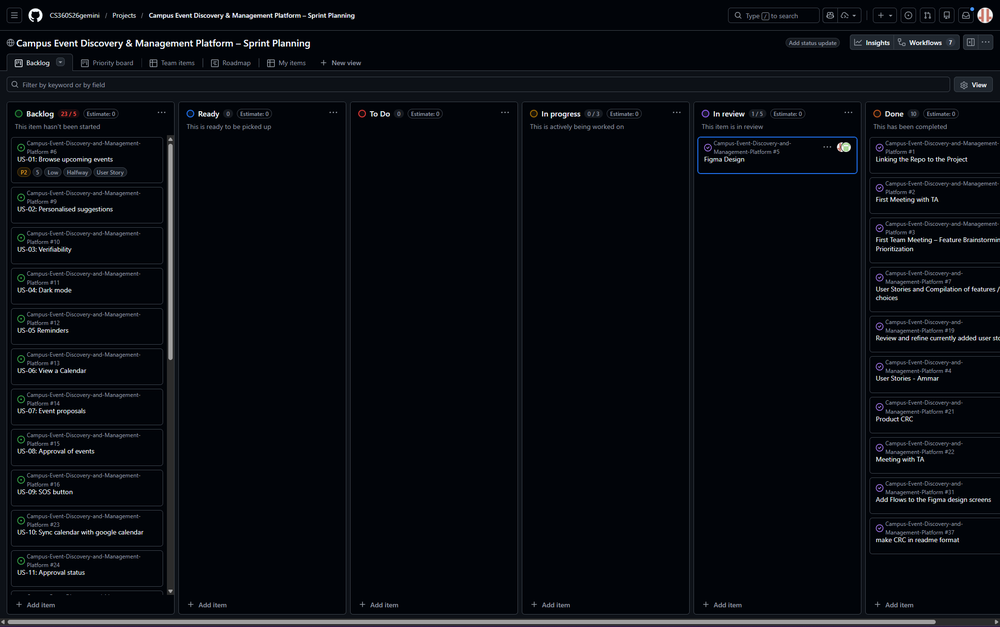
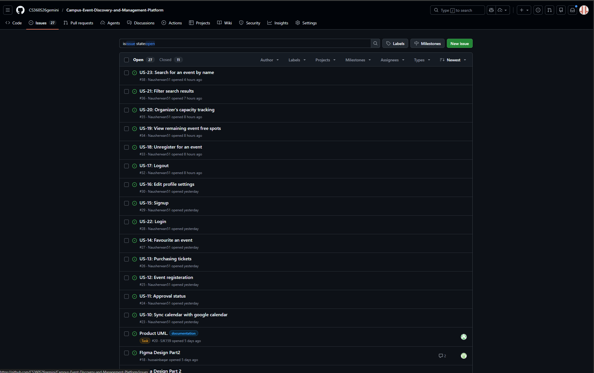
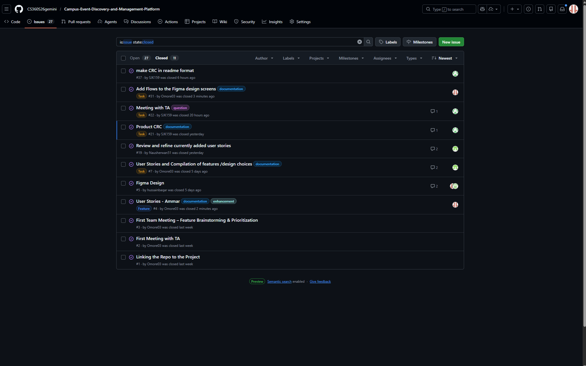
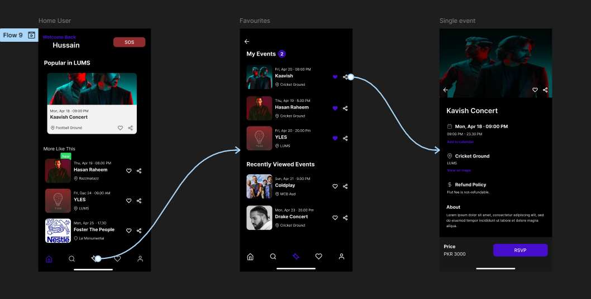
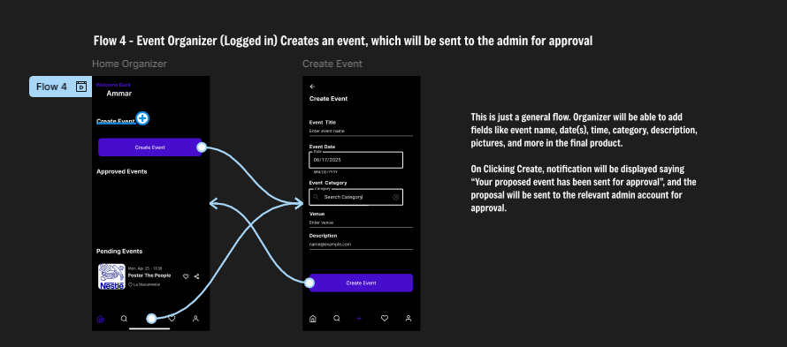

## Quick Links
- **Repository:** <PASTE_REPO_LINK>
- **GitHub Project Board:** <PASTE_PROJECT_LINK>
- **Figma Wireframes:** <PASTE_FIGMA_LINK>

## Table of Contents
1. [Project Overview](#project-overview)
2. [Team Information](#team-information)
3. [Product Backlog](#product-backlog)
4. [GitHub Project Board](#github-project-board)
5. [UI Mockups & Storyboards](#ui-mockups--storyboards)
6. [CRC Cards (OO Analysis)](#crc-cards-oo-analysis)
7. [Meeting Minutes](#meeting-minutes)

---

## Project Overview
**Problem:** Students miss campus events because information is scattered.  
**Solution:** A centralized Android app to discover events, RSVP, and help organizers manage capacity and updates.

**Primary Users:** Students, Event Organizers/Clubs, Admins

**Core Features:** Event discovery, RSVP tracking, organizer dashboard, capacity management, notifications, calendar integration.

---

## Team Information
| Name                      | GitHub Username | Roll Num   |
|-------------------------  |-----------------|------------|
| Muhammad Ammar Anees      | Omore03         | 27100077   |
| Muhammad Hussain Baqar    | husssainbaqar   | <roll_num> |
| Muhammad Yahya Rahim      | 27100218        | 27100218   |
| Saad Jamshaid Khan        | SJK159          | 27100159   |
| Nausherwan Khan           | Nausherwan51    | <roll_num> |

---

## Product Backlog
### Story Point Scale
We use Fibonacci-style story points: **1, 2, 3, 5, 8, 13**.

**1**  : Very Small

**2**  : Small/Simple

**3**  : Moderate

**5**  : Medium/Complex

**8**  : Large/Complex

**13** : Very Large/Risk

### Backlog Summary Table
| ID | User Story Title | Points | Risk | Release |
| :--- | :--- | :--- | :--- | :--- |
| US-01 | Browse upcoming events | 5 | Low | Halfway |
| US-02 | Personalised suggestions | 8 | Medium | Final |
| US-03 | Verifiability | 3 | Low | Halfway |
| US-04 | Dark mode | 3 | Low | Halfway |
| US-05 | Reminders | 3 | Low | Final |
| US-06 | View a Calendar | 8 | Low | Halfway |
| US-07 | Event proposals | 8 | Medium | Halfway |
| US-08 | Approval of events | 5 | Low | Halfway |
| US-09 | SOS button | 8 | Medium | Final |
| US-10 | Sync calendar with google calendar | 8 | High | Final |
| US-11 | Approval status | 3 | Low | Halfway |
| US-12 | Event registeration | 5 | Medium | Halfway |
| US-13 | Purchasing tickets | 13 | High | Final |
| US-14 | Favourite an event | 3 | Low | Halfway |
| US-15 | Signup | 5 | Low | Halfway |
| US-16 | Edit profile settings | 5 | Low | Halfway |
| US-17 | Logout | 2 | Low | Halfway |
| US-18 | Unregister for an event | 5 | Medium | Halfway |
| US-19 | View remaining event free spots | 3 | Low | Halfway |
| US-20 | Organizer's Capacity tracking  | 5 | Medium | Halfway |
| US-21 | Filter search results | 5 | Low | Halfway |
| US-22 | Login | 3 | Low | Halfway |
| US-23 | Search | 5 | Low | Halfway |

> Full user story details are maintained as **GitHub Issues** and tracked on the GitHub Project Board.

---

## GitHub Project Board
### Screenshots (Required)

---

## UI Mockups & Storyboards
https://www.figma.com/design/sfGIqbeoa6RM4zd8J4XmN1/App-Design?node-id=1-11126&t=YQVGRicy31ela19x-1

## Main Screens
.png)
.png)
.png)

### Storyboard Sequences
**Student RSVP Flow** (covers US-01, US-04, US-05):  
Event List → Event Details → Tap RSVP → Confirmation

**Organizer Create Event Flow** (covers US-07):  
Organizer Dashboard → Create Event Form → Publish → Event Appears in List

---

## CRC Cards (OO Analysis)
We document CRC cards in `docs/crc.md`.

---

## Meeting Minutes
Meeting minutes are stored in `docs/meeting-minutes/`.

- [Meeting 1](meeting-minutes/meeting-1.md)
